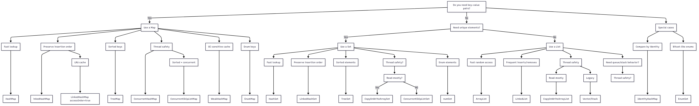

Choosing the right data structure in Java can make the difference between code that simply works and code that is truly fast, scalable, and reliable. With the vast toolkit offered by the Java Collections Framework and java.util.concurrent, it’s easy to feel overwhelmed — ArrayList or LinkedList? HashMap or ConcurrentHashMap? BlockingQueue or lock-free alternatives?  

In this article, we’ll cut through the noise with clear, practical guidance: which structure to use, when to use it, and why. From performance considerations to concurrency safety, this guide will help you make the smart choice every time.  

Let’s go through the Java Collections Framework (and a few extras in java.util.concurrent), but framed from a practical performance + concurrency perspective.  

## 📚 **Core Java Data Structures and When to Use Them**  
### List Implementations  
**ArrayList**  
✅ Best for: Random access, iteration.  
❌ Avoid when: Many insertions/deletions in the middle.  
Perf: Backed by an array, so get(int) and set(int) are O(1), but inserts/removes (except at end) are O(n).  

***LinkedList***  
✅ Best for: Frequent inserts/removes at both ends (addFirst, addLast).  
❌ Poor for: Random access (get(i) is O(n)).  
Perf: Doubly linked nodes, predictable memory usage but slower iteration (cache-unfriendly).

**CopyOnWriteArrayList (concurrent)**  
✅ Best for: Mostly-read, rarely-write scenarios in multithreaded contexts (e.g., event listeners).  
Perf: Writes copy the entire array → expensive, but reads are lock-free and very fast.

### Set Implementations  
**HashSet**  
✅ Best for: Fast lookup and uniqueness.  
Perf: Backed by HashMap, average O(1) add/remove/contains.

**LinkedHashSet**  
✅ Best for: Fast lookup + predictable iteration order (insertion order).  
Perf: Slightly slower than HashSet due to linked list overhead.  

**TreeSet**  
✅ Best for: Sorted unique data, range queries.  
Perf: Backed by a Red-Black tree. All ops are O(log n).

**ConcurrentSkipListSet** (concurrent)  
✅ Best for: Thread-safe sorted set with lock-free reads.  
Perf: Based on skip lists, good scalability under contention.

### Map Implementations  
**HashMap**  
✅ Best for: General key/value storage with fast lookup.  
Perf: Average O(1) for get/put. Not thread-safe.

**LinkedHashMap**  
✅ Best for: Fast lookup + predictable iteration order.  
Special: Supports access-order iteration → ideal for LRU caches.

**TreeMap**  
✅ Best for: Sorted map with range queries.  
Perf: O(log n) for get/put. Higher overhead than HashMap.

**ConcurrentHashMap** (concurrent)  
✅ Best for: High-concurrency map with frequent reads/writes.  
Perf: Lock-striping, non-blocking reads, scalable under contention.

**WeakHashMap**  
✅ Best for: Caches where keys should be GC-collected when no longer referenced.  
Perf: Slight overhead due to reference queues.

### Queue & Deque Implementations  
**ArrayDeque**  
✅ Best for: Fast stack/queue (double-ended).  
Perf: Much faster than LinkedList for stack/queue operations.

**PriorityQueue**  
✅ Best for: Always retrieving the "smallest" or "largest" element.  
Perf: Backed by a binary heap, O(log n) insertion/removal.

**ConcurrentLinkedQueue** (concurrent)  
✅ Best for: Lock-free FIFO in multi-threaded environments.  
Perf: Scales well with many producers/consumers.

**BlockingQueue** family (e.g., LinkedBlockingQueue, ArrayBlockingQueue)  
✅ Best for: Producer/consumer designs with thread blocking.  
Perf: Choice depends on bounded/unbounded and fairness requirements.

**ConcurrentLinkedDeque** (concurrent)  
✅ Best for: Lock-free double-ended queue, suitable for work-stealing.

### Specialized Collections  
**EnumSet / EnumMap**  
✅ Best for: High-performance collections keyed by enums.  
Perf: Backed by bit vectors, extremely fast and memory efficient.

**IdentityHashMap**  
✅ Best for: When key identity (==) matters instead of equality (equals()).  
Perf: Rare use cases like serialization, object graph traversal.

## 🚀 **Rules of Thumb**  
**High lookup speed?** → HashMap / HashSet.  
**Need ordering?** → LinkedHashMap / TreeSet / TreeMap.  
**Sorted & concurrent?** → ConcurrentSkipListMap / ConcurrentSkipListSet.  
**Producer/consumer threads?** → BlockingQueue.  
**Read-heavy, write-rarely?** → CopyOnWriteArrayList / CopyOnWriteArraySet.  
**Event-driven caching?** → LinkedHashMap with access-order eviction.  
**GC-aware caching?** → WeakHashMap.

>⚡**Performance tip**:  
>
> In single-threaded contexts, prefer non-concurrent versions — they’re much faster. For concurrency, always start with ConcurrentHashMap or ConcurrentLinkedQueue before rolling your own synchronization.  

Flow chart based on the description above: 
  
**[Java Collections Framework decision flow chart](../../assets/articles/05-09-2025-java-collections-mermaid-chart.png)**  

**Sample code**: [Github repo](#)  
**Mermaid chart code**: [here](./05-09-2025-java-collections-mermaid-chart.md)  
