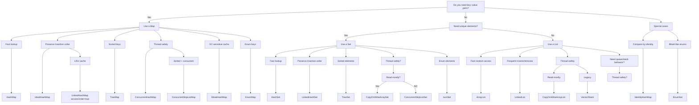

```mermaid
flowchart TD

    A[Do you need key–value pairs?] -->|Yes| B[Use a Map]
    A -->|No| C[Need unique elements?]

    B --> B1[Fast lookup] ----> B1a[HashMap]
    B --> B2[Preserve insertion order] ----> B21[inkedHashMap]
    B2 --> B2a[LRU cache] ---> B2a1[LinkedHashMap accessOrder=true]
    B --> B3[Sorted keys] ----> B3a[TreeMap]
    B --> B4[Thread safety]
    B4 ----> B41[ConcurrentHashMap]
    B4 --> B42[Sorted + concurrent] ---> B42a[ConcurrentSkipListMap]
    B --> B5[GC-sensitive cache] ----> B5a[WeakHashMap]
    B --> B6[Enum keys] ----> B6a[EnumMap]

    C -->|Yes| D[Use a Set]
    C -->|No| E[Use a List]

    D --> D1[Fast lookup] ---> D1a[HashSet]
    D --> D2[Preserve insertion order] ---> D2a[LinkedHashSet]
    D --> D3[Sorted elements] ---> D3a[TreeSet]
    D --> D4[Thread safety?]
    
    D4 --> D42[Read-mostly?] --> |Yes|D42a[CopyOnWriteArraySet]
    D42 --> |NO| D41[ConcurrentSkipListSet]
    D --> D5[Enum elements] ---> D5a[numSet]

    E --> E1[Fast random access] ---> E1a[ArrayList]
    E --> E2[Frequent inserts/removes] ---> E2a[LinkedList]
    E --> E3[Thread safety]
    E3 --> E31[Read-mostly] --> E31a[CopyOnWriteArrayList]
    E3 --> E32[Legacy] --> E32a[Vector/Stack]

    E --> F[Need queue/stack behavior?]
    F --> F3[Thread safety?]
    
    %% Special cases
    A --> S[Special cases]
    S --> S1[Compare by identity] ----> S1a[IdentityHashMap]
    S --> S2[Bitset-like enums] ----> S2a[EnumSet]
```
