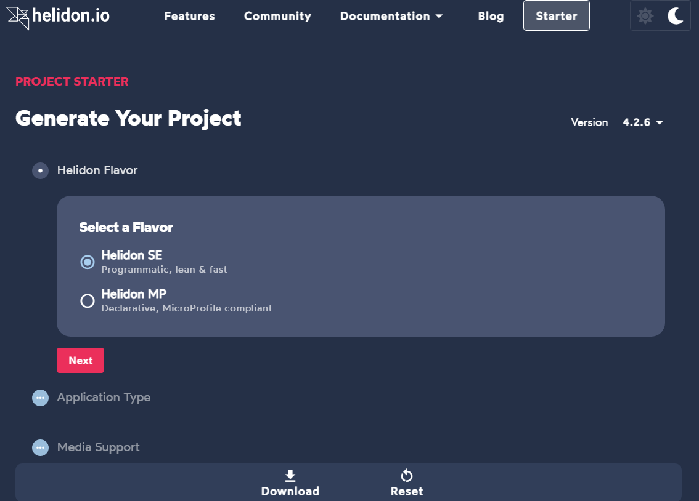

In today’s cloud-native world, building lightweight, high-performance microservices in Java often means balancing **standards compliance** with **simplicity and speed**. **Helidon MP**, a project from Oracle, does exactly that: it combines the power of **Eclipse MicroProfile** with a minimalistic runtime, offering a modern platform for enterprise Java microservices.

In this article, we will dive into the world of Helidon MP and create a Helidon MP based project!

## What Is Helidon MP?

Helidon MP is the **MicroProfile edition** of Helidon. While Helidon SE provides a functional, low-level API for microservices, Helidon MP adds a full stack of **enterprise-ready features**:

-   **JAX-RS** for building RESTful APIs
    
-   **CDI** for dependency injection
    
-   **JSON-P/B** for JSON processing
    
-   **Health checks, metrics, and tracing** for observability
    
-   **Fault tolerance and configuration** via MicroProfile APIs
    

Unlike traditional Java EE servers, Helidon MP is **lightweight, fast, and cloud-native**. It doesn’t require a full application server and runs directly on the JVM or as a **GraalVM native image**.

## Why Choose Helidon MP?

-   **Standards-Based**: Implementing MicroProfile ensures portability across compliant frameworks.
    
-   **Cloud-Ready**: Out-of-the-box support for **Docker, Kubernetes, Prometheus, and OpenTelemetry**.
    
-   **High Performance**: Minimal overhead and fast startup times make it ideal for microservices and serverless deployments.
    
-   **Modern Java Features**: Supports Java 21 features, including virtual threads, enabling simple, efficient concurrency.
    

## Getting Started
### Using Helidon Project Generator
Head to [helidon's starter page](https://helidon.io/starter/4.2.6?step=1) for a guided starter project generator.
  
Simply click download to access your project.

### Using Maven
A minimal Helidon MP project can be created using Maven:
```
mvn archetype:generate \
 -DarchetypeGroupId=io.helidon.archetypes \
 -DarchetypeArtifactId=helidon-mp \
 -DarchetypeVersion=4.0.0
```
From there, you can define JAX-RS endpoints, add MicroProfile health checks, and run your microservice in a few simple steps.

## Conclusion

Helidon MP is perfect for developers who want **enterprise Java microservices** that are **lightweight, standards-compliant, and cloud-ready**. By leveraging MicroProfile and Helidon’s high-performance runtime, you get the best of both worlds: modern microservices architecture without the complexity of a traditional Java EE server.

For more information, visit the official [Helidon website](https://helidon.io/?utm_source=chatgpt.com).
