## Coupling

&rarr; the degree of interdependence between software modules and components.

There are two types: **static** and **dynamic**.

### Static Coupling

&rarr; fixed, code/deployment-level dependencies. 

Example: a shared library, or direct code references — regardless of whether services are actively communicating.

### Dynamic Coupling

&rarr; runtime dependencies. 

Example: when Service A calls Service B *synchronously*, A becomes temporarily coupled to B's:

- **Availability** — if B is down, A fails too
- **Performance** — if B is slow, A is slow
- **Error behaviour** — B's errors propagate directly to A

### Transactional Coupling

&rarr; data processing dependencies.

Example: a customer request involves an update to 3 tables in a database. For this update to be atomic, all 3 transaction updates should happen or nothing at all. 

### Contract Coupling
&rarr; data transfer level: data exchange between microservices should agree on the data format being exchange (JSON schema, XML schema, RPC, etc).

More details on Managing Contracts section below.

### Temporal Coupling
&rarr; availability of the interacting microservices.

Example: microservice A requires microservice B to be available at a specific time to perform some functionality.

---

## The Three Primal Dynamic-Coupling Forces

Every distributed system is shaped by three fundamental tensions:

Each of these forces is acting in their own spectrum axis which combine to form the 8 saga patterns covered later in Section 4.

| Force | Options | Impact on Distributed System Characteristics
|---|---|---|
| **Communication** | Synchronous ↔ Asynchronous | ★★ |
| **Consistency** | Atomic ↔ Eventual | ★★★ |
| **Coordination** | Orchestration ↔ Choreography | ★ |

The impacts of each of these driving forces will become apparent when we compare 8 different types of sagas based on the permutation of the options.

---

## 1. Communication

### Synchronous vs. Asynchronous

|  Synchronous   |  Asynchronous   |
|  ---   |  ---   |
|  Tasks run in order |  Tasks run independently |
|  Often blocking the thread |  Using callbacks for completion  |

#### Blocking vs. Non-blocking
Subtle difference between synchronous/asynchronous and blocking/non-blocking: 

|  Synchronous/Asynchronous   |  Blocking/Non-blocking   |
|  ---   |  ---   |
|  On a system level |  On a thread level |
|  Relates to when a task finishes and how the result is handled (flow control) |  Relates to whether the thread is suspended while waiting for a task (resource state)  |

#### Examples

- **Synchronous & Blocking (Standard)**: You call a function, and your code stops (blocks) and waits for the result before moving to the next line.
Example: Reading a large file from disk; the program pauses until the file is fully loaded. 

- **Synchronous & Non-blocking**: You start a task and immediately get control back (non-blocking), but you must manually check back (polling) until the task is complete. 
Example: Starting a download, then checking the progress bar every few seconds, but you still wait for that specific download to finish to proceed. 

- **Asynchronous & Blocking (Rare/Inefficient)**: The task runs in the background (asynchronous), but you still stop and wait for it to finish.
Example: Starting a background task, but immediately sitting idle waiting for the "done" notification. 

- **Asynchronous & Non-blocking (Modern)**: You start a task and immediately move on to other work (non-blocking). When the task finishes, you are notified (asynchronous).
Example: Sending an API request with a callback function; the main thread continues executing other code and handles the result only when the request completes.

#### Architectural Quantum

> *An architecture quantum establishes the scope for a set of architectural characteristics.*

Characteristics of a quantum:
- **Independent** deployment
- High functional cohesion
- Low external-implementation static coupling
- **Synchronous** communication with other quanta

**Synchronous calls** create *"dynamic quantum entanglement"* — they couple the operational characteristics of separate services. A slow or unavailable downstream service degrades the entire call chain, i.e. the weakest characteristic of a service becomes the characteristic of the system.

> ***Your system is only as good as the least characteristics  ***

**Asynchronous calls**, on the other hand, retains the architecture quantum of individual services in a system. 

Example:

In the above picture, the microservices on the right side form 1 architectural quanta because of the **synchronous communication** among the services. 

When Portfolio Management System communicates with Trade Order Orchestrator, 2 things can happen:

1. If they communicate synchronously, they form into 1 architectural quantum => architectural characteristics drop to the lower level in the workflow.

2. If they communicate asynchronously, they stay separated as 2 architectural quanta => architectural characteristics are retained. 

> *So how do we determine the communication type should be synchronous or asynchronous?* 
> 
> It depends on **whether the service needs to wait** for the response from another service. If so, then it’s synchronous. 
> 
> Also for simplicity, default to synchronous communication. **Synchronous** &rarr; **simpler**

#### Trade-off Summary

| | Synchronous | Asynchronous |
|---|---|---|
| Easy to reason about | ✅ | |
| Mimics non-distributed calls | ✅ | |
| Easier to implement | ✅ | |
| Highly decoupled | | ✅ |
| High performance and scale | | ✅ |
| Common performance tuning technique | | ✅ |
| Performance impact on interactive systems | ⚠️ | |
| Creates dynamic quantum entanglements | ⚠️ | |
| Complex to build and debug | | ⚠️ |
| Difficult for transactional behaviour | | ⚠️ |
| Complex error handling | | ⚠️ |

---

### Managing Contracts

When a service calls a method in another service, it’s a **contract** between the 2 services of what the request and response formats should be like.

#### Strict vs. Loose Contracts

| | Tight (Strict) | Loose |
|---|---|---|
| Guaranteed contract fidelity | ✅ | |
| Build-time validation | ✅ | |
| Better for decoupled architectures | | ✅ |
| Easier to evolve | | ✅ |
| Decouples integration from implementation platform | | ✅ |
| Brittle integration points | ⚠️ | |
| Requires versioning | ⚠️ | |
| Less certainty; needs fitness functions | | ⚠️ |
| Requires developer discipline | | ⚠️ |

**Principle:** *Transfer values, not types.* Value-based (loose) contracts decouple consumers from implementation changes.

#### Contract Fitness Functions

Consumer-Driven Contracts (CDCs) can automate contract verification. 

The **Pact** framework ([docs.pact.io](https://docs.pact.io)) supports this for REST and event-driven architectures, with CI/CD integration.

---

### Event Payload Design

> *Should an event carry the **full data payload** or just **key identifiers**?*

| Trade-off Dimension | Full Payload | Key-Only Payload |
|---|---|---|
| Scalability & performance | ✅ Good | ⚠️ Poor |
| Contract management & versioning | ⚠️ Complex | ✅ Simple |
| Single system of record | ⚠️ Multiple | ✅ Single |
| Stamp coupling & bandwidth | ⚠️ High | ✅ Low |

> ***Choose Key-Only Payload if scalability and performance are not the priority***

**Stamp coupling example:** A customer profile returning 500 KB payloads at 2,000 req/s uses ~1,000,000 KB/s of bandwidth. Returning only required fields (~200 bytes) reduces this to ~400 KB/s — a **2,500× reduction**.

> **Looser contracts create less brittle software architectures.**

---

## 2. Coordination

### Orchestration vs. Choreography

#### Orchestration

- generally one orchestrator per major workflow
- orchestrator owns state and communicates update points to services

#### Choreography

- services react to events
- no central controller
- the workflow emerges from the chain of events

#### Hybrids

- an orchestrated outer workflow can delegate to choreographed sub-workflows

#### Summary

| | Orchestration | Choreography |
|---|---|---|
| State owner | Central orchestrator | Distributed across services |
| Workflow control | Centralised &rarr; tighter coupling | Emergent / event-driven &rarr; loose coupling |
| Error handling | ✅ Easier — one place | ⚠️ Harder — spread across services |
| Responsiveness | Moderate | ✅ High |
| Scalability / throughput | Moderate | ✅ High |
| Fault tolerance | ✅ Good | ✅ Better |
| Recoverability | ✅ Good | ⚠️ Difficult |
| Workflow / state management | ✅ Good | ⚠️ Complex |

---

## 3. Consistency

### ACID Transactions

- **Atomicity** — all steps in a transaction either fully succeed or fully roll back together; there is no partial completion. 

- **Consistency** — a transaction always moves the database from one valid state to another, never leaving data in a corrupt or rule-violating state.

- **Isolation** — concurrent transactions are invisible to each other until committed, so one transaction cannot see another's in-progress changes.

- **Durability** — once a transaction is committed, the data is permanently saved and survives any subsequent system failure.

In a distributed context, standard ACID properties break down:

| Property | Problem in Distributed Systems |
|---|---|
| **Atomicity** | Each service commits/rolls back independently — a failure mid-chain leaves partial state |
| **Consistency** | An error in one service (e.g. inventory) causes data inconsistency across others |
| **Isolation** | Inserted data may be visible to other services before the overall transaction completes |
| **Durability** | Data is only made permanent at the service level, not the transaction level |

### BASE Transactions

As an alternative, **BASE** (***B**asically **A**vailable, **S**oft state, **E**ventually consistent*) is the natural fit for distributed, decoupled systems.

### Eventual Consistency Patterns

**Sample problem**: Deleting a customer in one service must propagate to dependent services (wish list, preferences, etc.).

3 patterns for propagating state changes from the sample above:

1. **Background Synchronisation** &rarr; a background job reads across databases to sync state.  
   ⚠️ Creates direct database coupling between services.   
   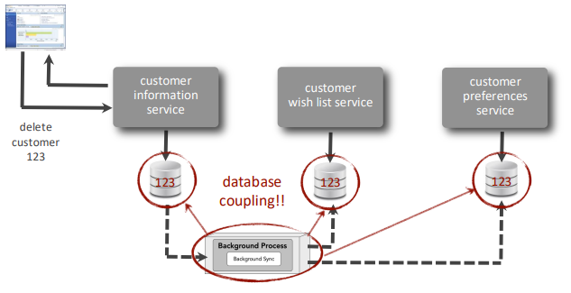

2. **Event-Based Data Synchronisation** &rarr; the originating service fires an event; consumers react.  
   ✅ Decoupled. Standard Event-Driven Architecture pattern.   
   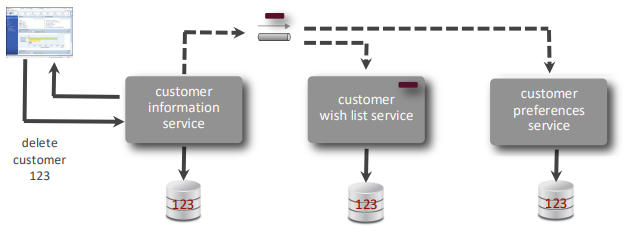

3. **Workflow Event Pattern** &rarr; a dedicated workflow processor mediates between the event producer and consumers, handling ordering and retries.   
   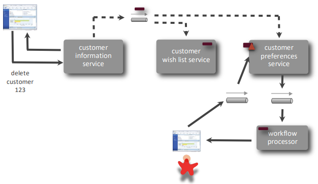

---

### Compensating Updates

When a step fails partway through a distributed transaction, previously committed changes must be **compensated** (rolled back manually).

**Fallacies of compensating updates:**
- The compensating update itself may fail
- Side effects may have already occurred (e.g. an email sent, a charge processed)
- State management becomes complex

**Mitigation (by state management):** Marking data as `WIP (Work-In-Progress)` vs `PLACED` allows services to avoid querying data not yet in a finalisable state, reducing inconsistency windows.

> When a system incorporates process for compensating updates, execution logs is crucial for traceability.

---

## 4. Transactional Sagas

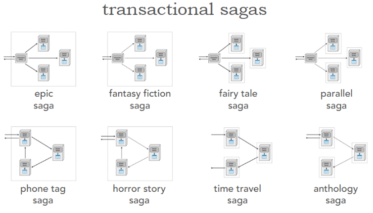

8 Saga patterns can be formed by combining the 3 coupling forces:

| Saga | Consistency | Coordination | Communication |
|---|---|---|---|
| **Epic Saga** | Atomic | Orchestration | Sync |
| **Fantasy Fiction Saga** | Atomic | Orchestration | Async |
| **Phone Tag Saga** | Atomic | Choreography | Sync |
| **Horror Story Saga** | Atomic | Choreography | Async |
| **Fairy Tale Saga** | Eventual | Orchestration | Sync |
| **Parallel Saga** | Eventual | Orchestration |  Async |
| **Time Travel Saga** | Eventual | Choreography | Sync |
| **Anthology Saga** | Eventual | Choreography | Async |

---

### Saga Descriptions

#### 🗡️ Epic Saga — *"A long-running, heroic story"*

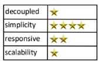

- Mimics a non-distributed transactional interaction
- Holistic transactional coordination increases coupling
- Easy to understand; difficult to implement

**Use when:** Each step must complete before the next starts; absolute transactionality matters more than responsiveness.

---

#### 📖 Fantasy Fiction Saga — *"A complex story that's hard to believe in the end"*

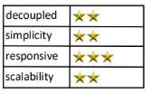

- Moving to async communication improves performance/responsiveness…
- …but introduces concurrency issues that may be worse than the original performance problems

**Use when:** A first attempt at improving an Epic Saga; responsiveness matters more than strict ordering.

---

#### 🏡 Fairy Tale Saga — *"An easy story with a pleasant ending"*

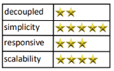

- Sync + orchestrated = easiest to reason about
- The **Orchestrated Saga** in [Chris Richardson's Microservices Patterns](https://learning.oreilly.com/library/view/-/9781617294549/) book

**Use when:** Medium to complex workflows that don't need extreme scale. **Default choice for most situations.**

---

#### ⚡ Parallel Saga — *"Multiple stories running at the same time"*

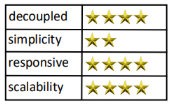

- Orchestrator allows complex workflows with concurrency
- Highly attractive for complex workflows at high scale
- Difficult if ordering of updates matters

---

#### 📞 Phone Tag Saga — *"Like the game of phone tag"*

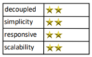

- An unusual combination: atomic + choreography
- Adds scalability to a simple transactional workflow when the orchestrator becomes a bottleneck
- Not common in practice

---

#### 😱 Horror Story Saga — *"A nightmare"*

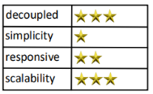

- Attempts atomic workflows without a coordinator, with concurrency on top
- Workflow, error handling, boundary conditions, and transactionality are spread across domain services
- Middling performance coupled with impossible-to-reproduce errors
- Actually an ***anti-pattern***

⚠️ **Not uncommon in practice.** Usually a well-intentioned but flawed attempt to achieve high performance with atomicity.

---

#### ⏳ Time Travel Saga — *"A problem that moves atomically through time"*

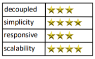

- No orchestrator makes complex workflows difficult
- Best for pipeline problems (chain-of-responsibility, pipes-and-filters) with staging or additive workflows
- Works best when synchronous communication is acceptable

---

#### 📚 Anthology Saga — *"A loosely associated group of short stories"*

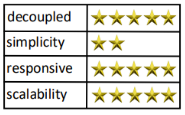

- The **Choreographed Saga** in [Chris Richardson's Microservices Patterns](https://learning.oreilly.com/library/view/-/9781617294549/) book
- Polar opposite of the Epic Saga
- Best for non-transactional pipes-and-filters architecture styles
- Highly scalable due to lack of coupling - the least coupled option

---

### Quantitative Trade-off Summary

Mixing the properties of the 3 axes of dynamic coupling forces, ***Consistency*** choice has the greatest impact on saga quality, followed by ***Coordination*** style then ***Communication*** mode.

**Consistency &rarr; Coordination &rarr; Communication**

| Axis | Impact on Decoupling / Scalability |
|---|---|
| **Consistency**:   Atomic → Eventual | **+163%** improvement |
| **Coordination**:   Orchestration → Choreography | **+143%** improvement |
| **Communcation**:   Sync → Async | **+55%** improvement |

---

### Saga Profiles

Below is the 8 transactional sagas score cards:

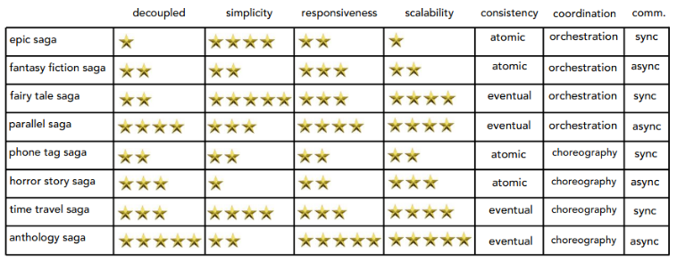

The table above gives a simplified guidance on the system architecture we should have to achieve the characteristic priorities implied. 

For example, to have a distributed system with low response latency, the table shows below:

Now the option is just either we want orchestrated or choreographed system. If scalability is the next priority, then anthology saga is the pattern we should follow. If simplicity is, parallel saga is the pattern.

Also from the table we can see that what drives an orchestration system down on scalability and responsiveness is not the orchestration itself but it’s the atomic transactions. Once we tweak the transactions to be eventual consistent, we should expect improvements in responsiveness and scalability of the system.

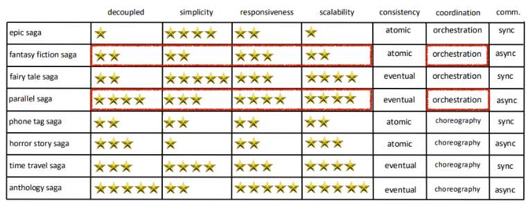

---

### Transactional Sharding

For very high-volume scenarios, **domain sharding** distributes load across **multiple Saga instances** for better performance/responsiveness. 

Example: a concert ticket sale spike can be handled by sharding by seat section or venue zone, avoiding a single transaction bottleneck.

Domain sharding maps naturally onto microservices: services can be sharded by geography or specialisation, allowing concurrent saga instances without contention.

---

## Key Principles Summary

| Principle | Implication |
|---|---|
| Synchronous calls create dynamic quantum entanglement | Default to async where responsiveness and scale matter |
| Looser contracts = less brittle software | Prefer **value-based** contracts in microservices |
| Stamp coupling wastes bandwidth | Send only the data a consumer needs |
| ACID breaks in distributed systems | Accept **eventual consistency** where business rules allow |
| Compensating updates have fallacies | Use state management to reduce inconsistency windows |
| **Fairy Tale Saga** is the **default** | Use it for most medium-complexity workflows |
| **Horror Story Saga** is an **antipattern** | Avoid atomic + choreography + async |
| **Anthology Saga** is the **most scalable** | Use for pipelines that don't require transactionality |
