I have a new software project. As a solution architect, where should I start?

# Expected Outcomes

[ ] Differentiate between an architectural style and a pattern, and understand how they fit together in software architecture
[ ] Identify patterns that you can use to tackle common architecture problems
[ ] Discover antipatterns to avoid in software architecture
[ ] Determine the proper communcation style to derive the most benefit from a particular architecture pattern

We will learn:
[ ] Key architectural patterns used within modern software architectures
[ ] The strengths and trade-offs associated with each pattern
[ ] Antipatterns to avoid when architecting software

# Introduction
An architectural pattern, much like a design pattern, is a reusable solution to problems an architect commonly encounters when designing systems. Exposure to architecture patterns, and knowing how to leverage them appropriately, are critical foundational skills for all architects.

Gaining a solid understanding of architectural patterns and a valuable toolkit to enhance your capability as a software architect is fundamental. Also is the case with knowing the differences between architectural styles (such as layered and microservices) and architectural patterns (such as messaging and caching patterns). With that foundation, we’ll delve into a variety of architectural patterns, their ideal applications, and the trade-offs each pattern presents. We’ll also explore emerging patterns and antipatterns in AI.

# Definitions
Architecture pattern = contextualised solution to an architectural problem. 

Architecture patterns affects topology and capabilities of the solution.

Anti-pattern = a solution that looks like a pattern but turns out to do more damage than benefit.

# Architecture Patterns

## Workflow Patterns 

### Orchestration  

#### Ideal Applications  

#### Trade-offs  

### Choreography

#### Ideal Applications  

#### Trade-offs 

### Hybrid

#### Ideal Applications  

#### Trade-offs  

## Broker Patterns

### Domain Broker Pattern

#### Ideal Applications  

#### Trade-offs

### Multi-Broker Pattern

#### Ideal Applications  

#### Trade-offs

## Event Contract Patterns

### Data-based Contract Pattern

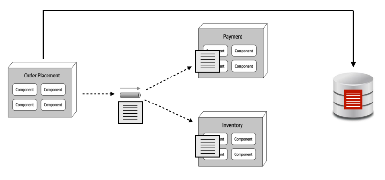

Characteristics:
- We transfer hydrated contract to each service

### Key-based Contract Pattern

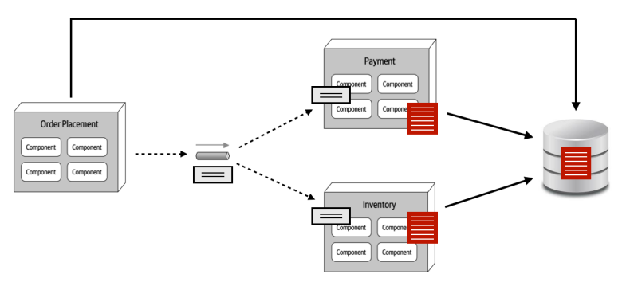

Characteristics:
- We only transfer the values each service needs
- We touch the DB a lot

### Comparison

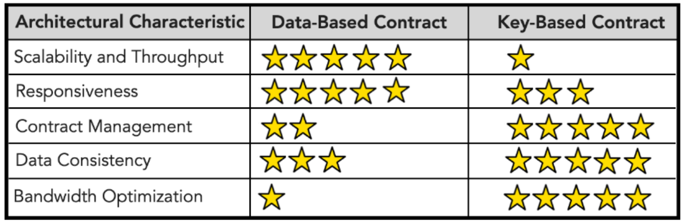

## Anti-Patterns

### Grain-of-Sand Anti-pattern

How small should your microservices be?

### Swarm-of-Gnats Anti-pattern

=> Triggering multitude events based on multiple state changes or actions.

The higher granularity a system has:
- The more fault tolerant the system is
- The lower the performance is due to multiple inter-service communication

There are some disintegrators and integrator that can be used to help break down and consolidate services. More information can be found here: <link to previous Confluence doc>

Consolidating several services into 1 can be a good answer to avoid swarm-of-gnats anti-pattern. Indication of this is when an event triggers all the relevant services, or none of the relevant services.

## Data Ownership Patterns

> Owner of a table is whoever writes to the table.

3 kinds of ownership:
1. Single
2. Joint
3. Common

### Single
1 owner => the service can be a microservice (highest data fidelity)

### Joint
2 owners => options:
a. Table split: clear separation and services can become microservices. A communication channel between the 2 services is needed.
b. Data domain: table become individual domain
c. Delegation: one service takes ownership and the other communicates with it
d. Consolidation: integrating 2 services into 1 microservice
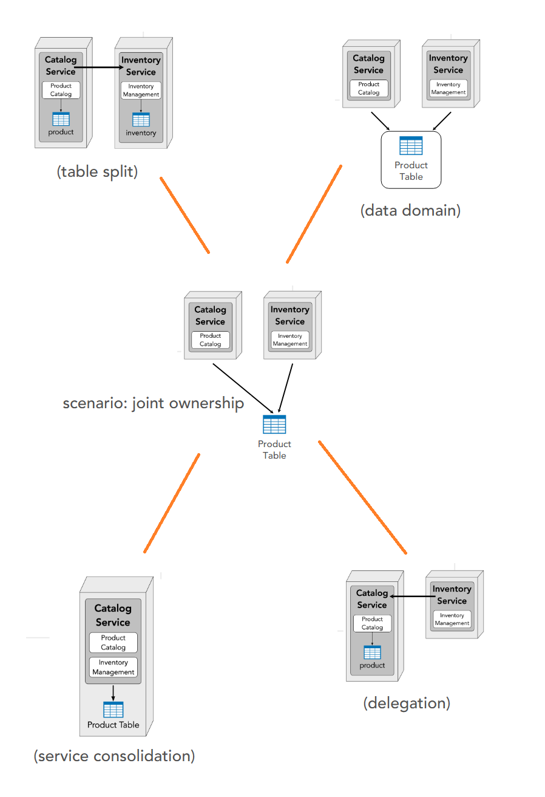
	
### Common
> 2 owners => create a (proxy) service to be the owner
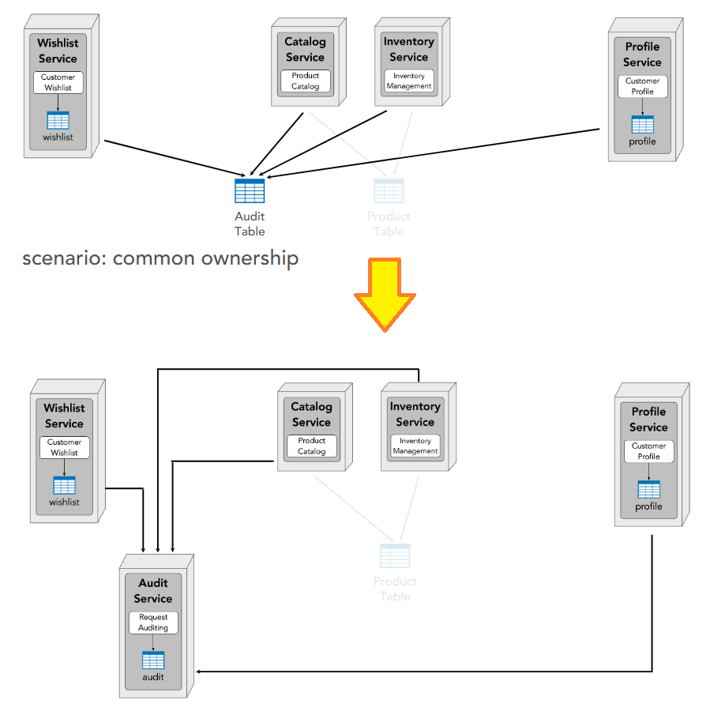

Data transfer (i.e. read data I don't own):
1. Interservice communication
2. Data replication
3. In-Memory Replicated Cache
4. Sidecar Distributed Cache
5. Data Domain

### Interservice communication
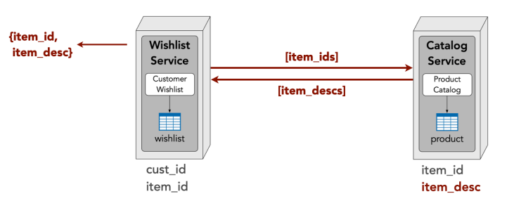

| Pros | Cons |
|------|------|
| ✅ go-to solution   ✅ easy to understand and implement | ❌ network, security, and data latency   ❌ scalability and throughput   ❌ fault tolerance |

### Data replication
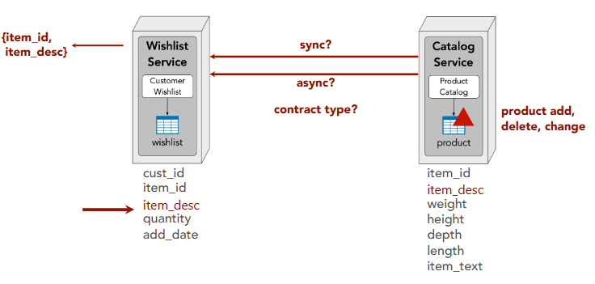

| Pros | Cons |
|------|------|
| ✅ network, security, and data latency   ✅ scalability and throughput   ✅ fault tolerance | ❌ data consistency issues   ❌ custom data synchronization   ❌ data ownership issues |

### In-Memory Cache
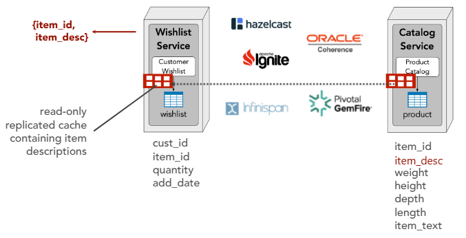

| Pros | Cons |
|------|------|
| ✅ network, security, and data latency   ✅ scalability and throughput   ✅ fault tolerance   ✅ no data consistency issues   ✅ no custom data synchronization   ✅ no data ownership issues | ❌ data volume issues   ❌ data update rate issues   ❌ eventually consistent   ❌ cold start dependency |

### Sidecar Distributed Cache
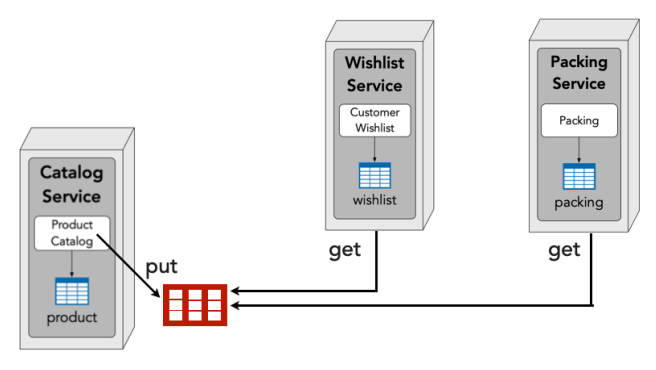

| Pros | Cons |
|------|------|
| ✅ network, security, and data latency   ✅ scalability and throughput   ✅ fault tolerance   ✅ no data consistency issues   ✅ no custom data synchronization   ✅ no data ownership issues   ✅ no data volume issues   ✅ no data update rate issues | ❌ cold start dependency   ❌ fault tolerance dependency |

### Data Domain (Shared Tables)
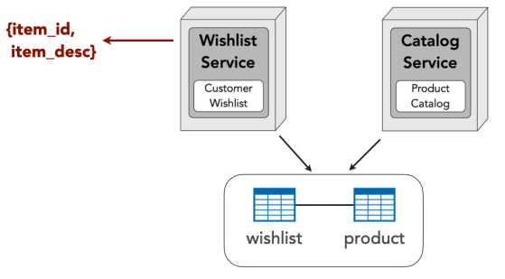

| Pros | Cons |
|------|------|
| ✅ network, security, and data latency   ✅ scalability and throughput   ✅ fault tolerance   ✅ no data consistency issues   ✅ no custom data synchronization   ✅ no data ownership issues   ✅ no data volume issues   ✅ no data update rate issues   ✅ no cold start dependency | ❌ change control   ❌ data ownership   ❌ possible security issues   ❌ forces the same DBMS for all data |

### Use Case
| Option | Best For |
|--------|----------|
| **Interservice communication** | ✅ large data volume   ✅ low responsiveness |
| **Data schema replication** | ✅ reporting   ✅ data aggregation |
| **In-memory replicated cache** | ✅ low data volume   ✅ high responsiveness |
| **Data sidecar distributed cache** | ✅ large data volume   ✅ high responsiveness |
| **Data domains (shared tables)** | ✅ high responsiveness   ✅ data dependencies |

### Summary of Data Ownership Patterns

| Criteria | Interservice Comm. | Data Replication | In-Memory Cache | Sidecar + Dist. Cache | Data Domain |
|---|:---:|:---:|:---:|:---:|:---:|
| **Performance & Reliability** | | | | | |
| Network, security & data latency | ❌ | ✅ | ✅ | ✅ | ✅ |
| Scalability and throughput | ❌ | ✅ | ✅ | ✅ | ✅ |
| Fault tolerance | ❌ | ✅ | ✅ | ✅ | ✅ |
| **Data Management** | | | | | |
| Data consistency | — | ❌ | ✅ | ✅ | ✅ |
| No custom data synchronization | — | ❌ | ✅ | ✅ | ✅ |
| Data ownership | — | ❌ | ✅ | ✅ | ❌ |
| Data volume | — | — | ❌ | ✅ | ✅ |
| Data update rate | — | — | ❌ | ✅ | ✅ |
| No cold start dependency | — | — | ❌ | ❌ | ✅ |
| Eventually consistent | — | — | ❌ | — | — |
| **Implementation** | | | | | |
| Easy to understand & implement | ✅ | — | — | — | — |
| No change control concerns | — | — | — | — | ❌ |
| No security concerns | — | — | — | — | ❌ |
| No fault tolerance dependency | — | — | — | ❌ | — |
| DBMS flexibility | — | — | — | — | ❌ |

## Caching Patterns
Caching topologies:
1. Single in-memory cache
2. Distributed (client/server) cache
3. Replicated (in-process) cache
4. Near-cache hybrid

### Cache-aside
> The application is the orchestrator for both read and write processes, i.e. the application is aware of both cache and datastore and which operation goes to where.

Read:
- When data available in cache, it takes 4 steps
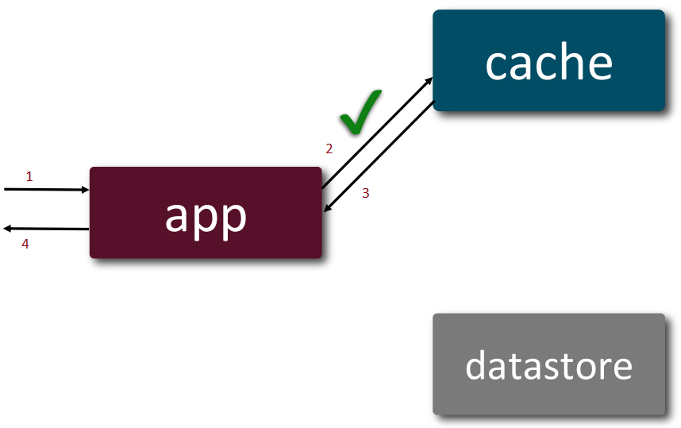
- In the event of a cache-miss, it takes 6 steps. This involves lazy-loading the cache with the missing data.
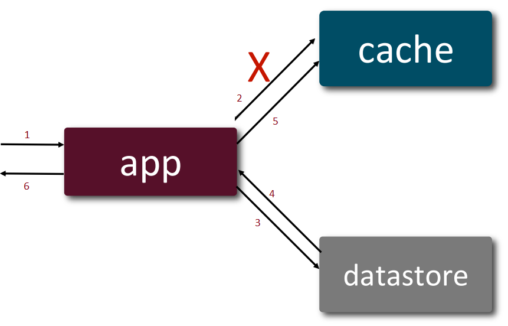

Write: takes 4 steps
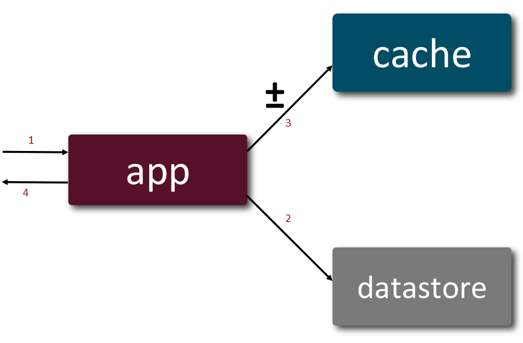

Use case:
- read-heavy loads
- content delivery systems
- reporting systems

| Pros | Cons |
|---|---|
| ✅ **Smaller cache size** because only requested data is cached   ✅ **Flexible implementation** because app manages what gets cached | ❌ **Higher latency** for data that sees a cache miss   ❌ **Higher load** on database depending on read patterns |

Star rating:
| Capability | With Pattern | Without Pattern |
|---|:---:|:---:|
| **Flexibility** | ★★★★★ | ★★★ |
| **Scalability** | ★★★★ | ★★ |
| **Read Throughput** | ★★★★★ | ★★ |
| **Write Throughput** | ★★★★ | ★★★★★ |
| **Cost** | ★★★★ | ★★★★★ |
| **Responsiveness** | ★★★★ | ★★ |
| **Consistency** | ★★ | ★★★★★ |
| **Simplicity** | ★★★ | ★★ |

Influences in caching topologies:
| Capability | Single In-Memory Cache | Client-Server Cache (Remote) | Replicated In-Memory Cache |
|---|:---:|:---:|:---:|
| **Flexibility** | ★★★★★ | ★★★★ | ★★★★ |
| **Scalability** | ★★ | ★★★★ | ★★★★★ |
| **Read Throughput** | ★★★★★ | ★★★ | ★★★★★ |
| **Write Throughput** | ★★★★ | ★★★ | ★★★ |
| **Cost** | ★★ | ★★★★ | ★ |
| **Consistency** | ★★ | ★★★★ | ★★★ |
| **Simplicity** | ★★★ | ★★★ | ★ |
| **Responsiveness** | ★★★ | ★★ | ★★★★ |

### Write Around
Read:
same as cache-aside

Write: takes 5 steps

?? Write-around skips writing to the cache altogehter??? Or, delete the relevant data?

Use case:
- write-heavy systems

### Read/Write Through
> The cache is the orchestrator for both read and write processes, i.e. as far as the application concerns, the cache **is** the only touch-point for data.

Read:
- When data available in cache, it takes 4 steps just like cache-aside
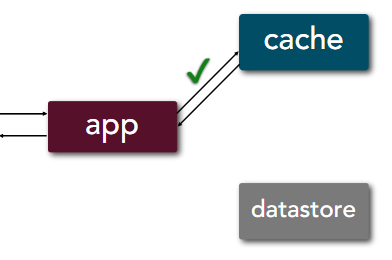
- In the event of a cache-miss, it takes 6 steps just like cache-aside but via cache
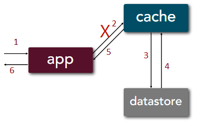

Write: takes 4 steps
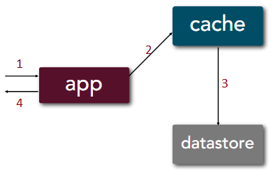

Use case:
- high consistency
- critical applications
- read-heavy systems

| Pros | Cons |
|---|---|
| ✅ **High data consistency** because cache and datastore are in sync   ✅ **Simplified app implementation** because read/write paths are symmetric   ✅ **Fast reads** because cache mirrors datastore | ❌ **Higher latency** for writes   ❌ **Specialized cache** implementation   ❌ **Larger cache size** because all data is cached |

Star rating:
| Capability | Using Read-Through/Write-Through | Without the Pattern |
|---|:---:|:---:|
| **Consistency** | ★★★★ | ★★★★★ |
| **Responsiveness (Reads)** | ★★★★ | ★★ |
| **Read Throughput** | ★★★★ | ★★ |
| **Simplicity** | ★★★★ | ★★ |
| **Scalability** | ★★★ | ★★ |
| **Flexibility** | ★★ | ★★★ |
| **Cost** | ★★ | ★★★ |
| **Write Throughput** | ★★ | ★★★ |
| **Responsiveness (Writes)** | ★★ | ★★★ |

Influences in caching topologies:
| Capability | In-Memory | Client-Server | Replicated In-Memory |
|---|:---:|:---:|:---:|
| **Consistency** | ★★ | ★★★★ | ★★★ |
| **Responsiveness** | ★★★★ | ★★★ | ★★★★ |
| **Read Throughput** | ★★★★★ | ★★★ | ★★★★★ |
| **Write Throughput** | ★★ | ★★ | ★★★ |
| **Scalability** | ★★ | ★★★★ | ★★★★★ |
| **Simplicity** | ★★★ | ★★★★ | ★★ |
| **Flexibility** | ★★★ | ★★ | ★★★ |
| **Cost** | ★★ | ★★★ | ★★ |

| Governance |
|---|
| ✅ **Cache sits** between app and datastore   ✅ Define **SLIs (Service Level Indicator) and SLOs (Service Level Objective)** for cache since they affect the entire architecture   ✅ **Chaos Engineering** to simulate latency and cache failure to assess architectural impact and resiliency |

### Write Behind
Write: takes 3 steps + async write
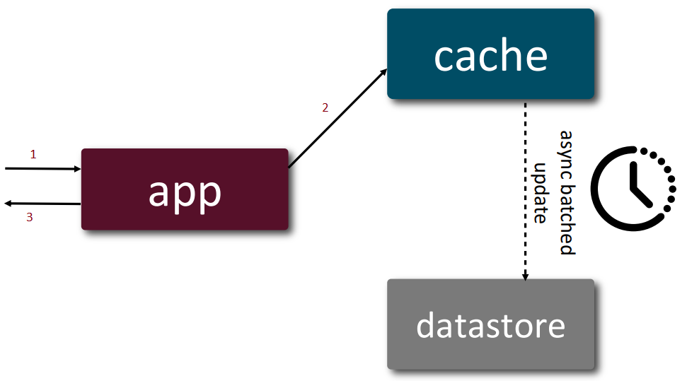

Use case:
- batch-processing applications
- write-heavy systems

| Pros | Cons |
|---|---|
| ✅ **Low latency for writes** because only cache needs updated   ✅ **Low database load** because writes are batched   ✅ **Fast reads** because cache mirrors datastore | ❌ **Single-point of failure** if cache fails   ❌ **Eventually consistent system** because all datastore updates are batched   ❌ **Larger cache size** because all data is cached |

### Prompt caching
With LLM, each time a user send a message, user prompt and system prompt are sent.  However, system prompt don't change. Hence, the system prompt is cache in the first instance. The 2nd time the user sends a message, the system will take the system prompt from cache and send both the system prompt and user prompt to LLM.

Use case:
- large system prompts

| Pros | Cons |
|------|------|
| ✅ less computational cost especially for large system prompts   ✅ better resource utilization because prompts are preprocessed | ❌ complex invocation pattern due to establishing breakpoints   ❌ llm specific since only some offerings support it|

### Summary of Caching Patterns

## Continuous Delivery / DevOps Patterns

### 12/15 Factor App principles

|| Principle | Summary | Diagram |
|---|-----------|---------|---------|
| 1 | **Codebase** | One codebase tracked in version control, many deploys | 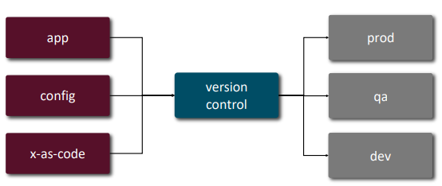 |
| 2 | **Dependencies** | Explicitly declare and isolate dependencies | 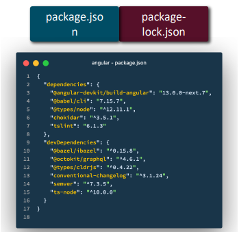 |
| 3 | **Config** | Store config in the environment, not in code | 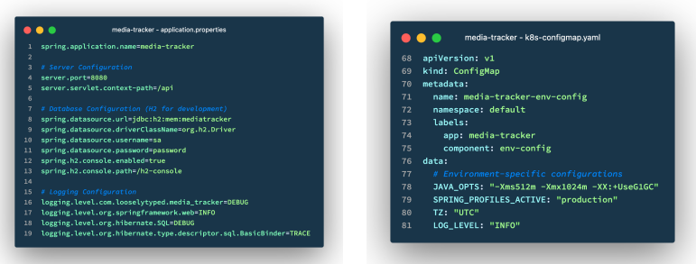 |
| 4 | **Backing Services** | Treat backing services (DB, cache, queue) as attached resources | 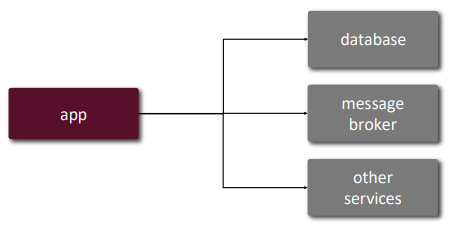 |
| 5 | **Build, Release, Run** | Strictly separate build and run stages | 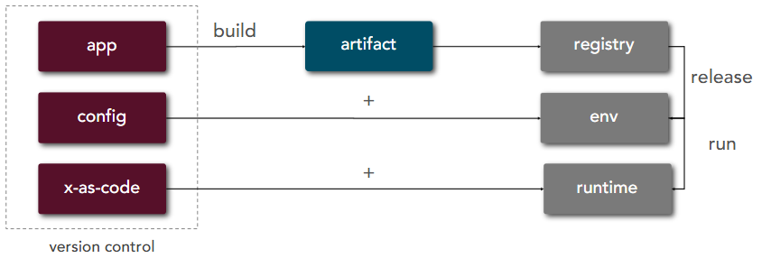 |
| 6 | **Processes** | Execute the app as one or more stateless processes | 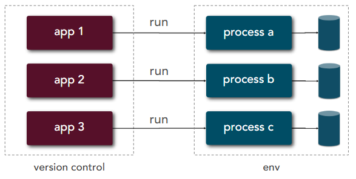 |
| 7 | **Port Binding** | Export services via port binding | 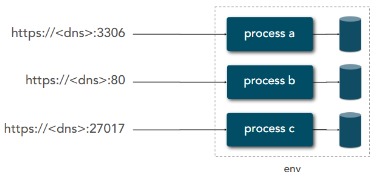 |
| 8 | **Concurrency** | Scale out via the process model | 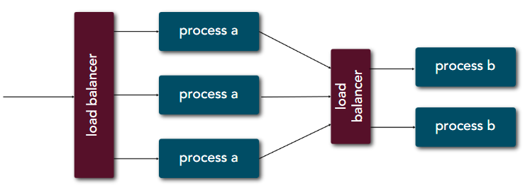 |
| 9 | **Disposability** | Maximise robustness with fast startup and graceful shutdown | 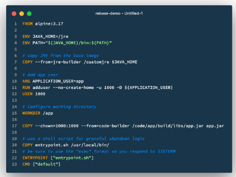 |
| 10 | **Dev/Prod Parity** | Keep development, staging, and production as similar as possible | 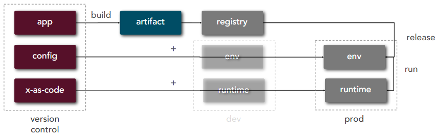 |
| 11 | **Logs** | Treat logs as event streams | 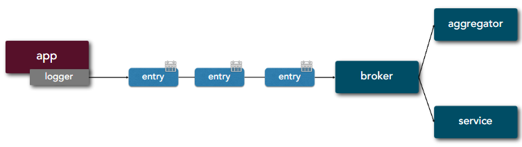 |
| 12 | **Admin Processes** | Run admin/management tasks as one-off processes | |
| 13 | **API First** |  |  |
| 14 | **Telemetry** |  | 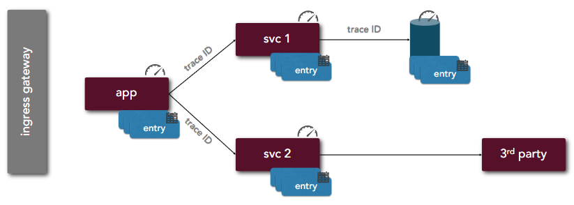 |
| 15 | **Authorisation/Authentication** |  |  |defence_in_depth_layers
| 15 | **Defence in depth layers** |  | 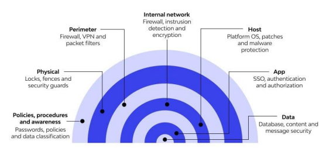 |

User case:
- cloud-nativeability
- security
- scalability
- resilience
- observability

## Deployment Strategies
3 deployment strategies:
1. Rolling deploys => one environment at a time
2. Blue-green => 2 sets of environments: blue (live) and green (new features)
3. Canary releases => hybrid between the 2: rolling traffic percentage between 2 sets of environments (blue and green)
	Benefits of canary release:
	- reduced risk of release
	- multi-variant testing
	- performance testing

---

# AI Patterns

## RAG (Retrieval Augmented Generation)

## Few-Shot Prompting
=> guided prompting technique using 2-5 examples for a new similar task.
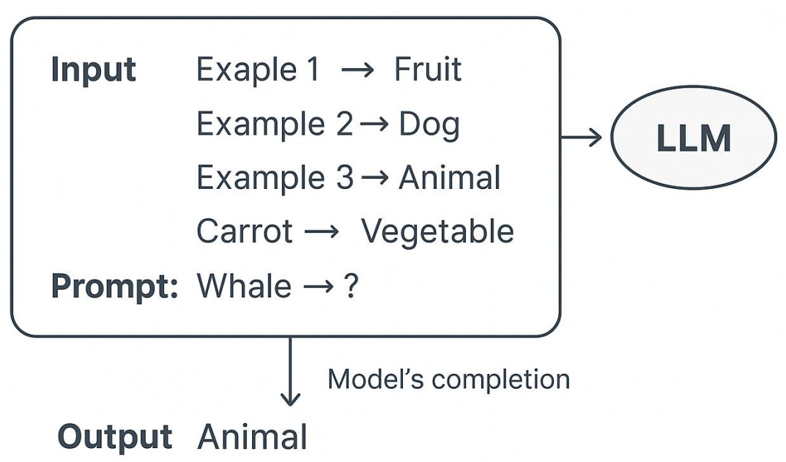

## Dynamic Few-Shot Prompting

## On-Device LLM Inference
Benefits:
- more secure handling of sensitive data
- extremely low latency (including video processing)
- reduced cost
- better reliability 

## LLM-as-Judge
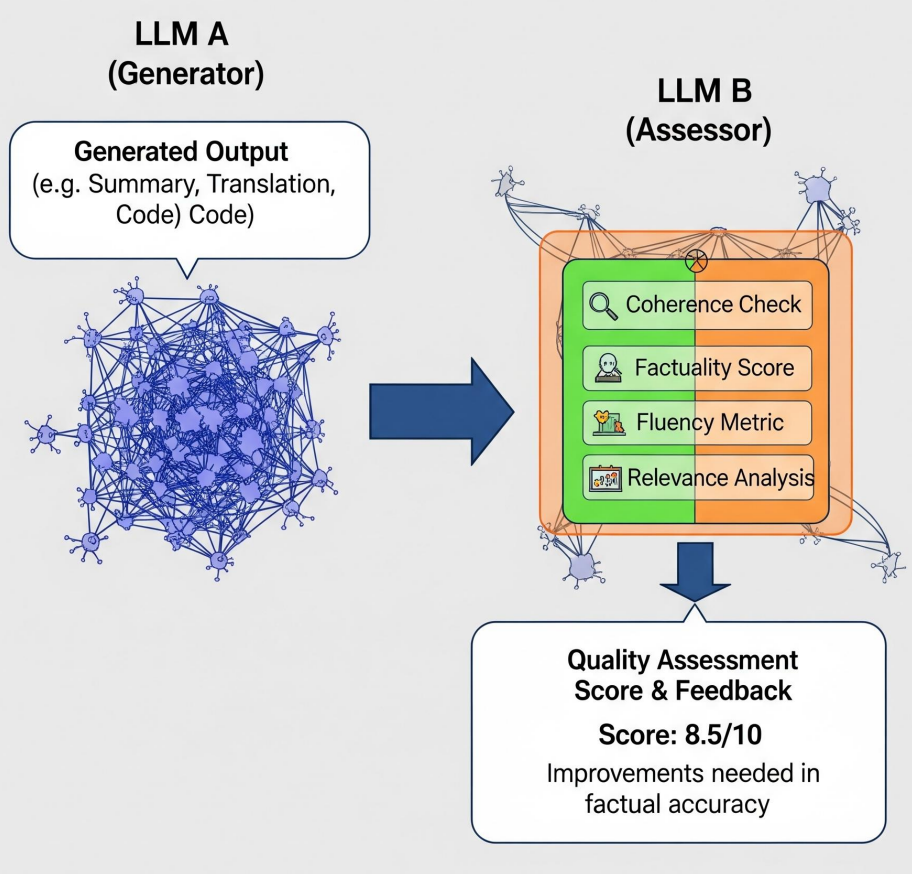

# AI Anti-patterns

## Halucinated Dependencies as Attack Factor
=> a potential security attack by bad actors due to dependency containing malicious code.

# Architecture Anti-Patterns

## Architecture by Implication
=> system lacking a clear documented architecture.

Some important details in architecture documents:
- What architecture pattern are you using?
- What client model is most appropriate?
- Which platform is best for this solution?
- Does the hardware or os matter?
- How will you handle component integration?
- Which communication protocols should you use?
- Is the solution feasible given skills, budget, and time?
- How secure does the system need to be?
- Does the system need to scale?
- How much performance is needed from the system?
- How available does the system need to be?
- Do you need to be concerned about maintainability?

## Gold Plating
=> continuing to define the architecture well past the point which the extra effort is adding any value

- Too many details hide the core principles and standards commonly leads to the analysis paralysis anti-pattern in that the initial architecture is never actually released
- Adding gold plating to a well-defined architecture significantly increases costs with little or no value
- A complex and overly-detailed architecture is hard to understand and comprehend => no "big picture"

## Covering Your Assets
=> continuing to document and present alternatives without ever making an architecture decision.

> **Architect's job**: present alternatives, articulate the pros and cons, and recommend best solution.

## Vendor King
=> product-dependent architectures leading to a loss of control of architecture and development costs.

Avoidance techniques:
- treat vendor app as a service (integration point), not the central of your system
- anti-corruption layer using message bus

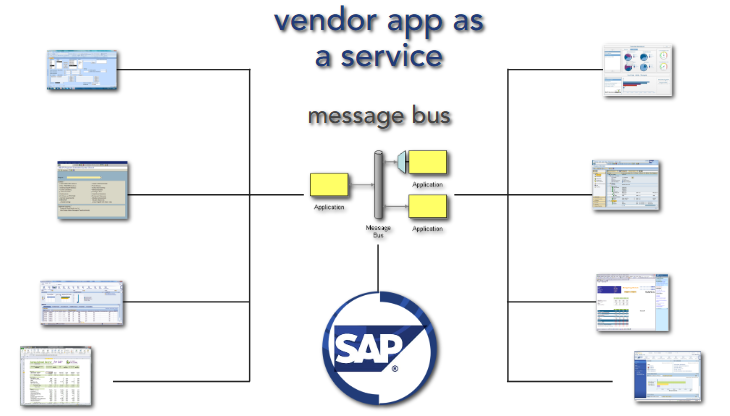

## Witches Brew
=> architectures are designed by groups resulting in a complex mixture of ideas and lack of clear vision

## Big Bang Architecture
=> designing the entire architecture at the beginning of the project when you know least about the system.

- Only architect what is absolutely necessary to get the project started and on the right track
- Let the architecture evolve throughout the project as you discover and learn more about the system
- Don't forget - requirements, technology, and business needs change constantly - and so must the architecture

## Armchair Architecture 
=> whiteboard sketches are handed off as final architecture standards without proving out the design. Be an integral part of your development team!!

- occurs when you have non-coding architects
- occurs when architects are not involved in the full project lifecycle
- occurs when architects don't know what they are doing
- stay current and try to carve out some coding for yourself, even if it is proof-of-concept code
- the best architects are the ones who have been in the trenches themselves and know the fallout from bad architecture decisions
- be careful not to release architecture decisions and standards too early

## Infinity architecture
=> creating architectures and interfaces that are overgeneralized with infinite flexibility.

- generalized architectures that solve every possible need are expensive and difficult to maintain and change - "we may need..."
- instead, use domain-specific architectures to *reduce* architecture and system scope

## Playing With New Toys
=> incorporating unproven technologies into an architecture that don't really fit the problem at hand.

when introducing a new technology, ask yourself:
- purpose: what value is it delivering?
- proven: is this a proven technology for your situation?
- overlap: is there something we have that is already supplying this functionality?
- feasibility: does your team have the skills necessary for the technology?

## Groundhog Day
- critical architecture decisions made early on are lost, forgotten, or not communicated effectively

Symptoms and consequences:
- people forget or don't know a decision was made 
- the same decision keeps getting discussed and made over and over and over...
- no one understands why a decision was made and they begin to question it again and again...

Avoidance technique:
- capture all important architecture decisions in some sort of work product (doc, wiki, etc.) and make it centrally available
- make sure the right stakeholders know about critical decisions and where to find them

## Spider Web Architecture
=> creating large numbers of web services that are never used just because you can.

- just because you can create a web service at the click of a button doesn't mean you should!
- let the requirements and business needs drive what services should be exposed

## Stovepipe Architecture
=> an ad-hoc collection of ill-related ideas, concepts, and components that leads to a brittle architecture.

Architecture by Implication anti-pattern combined with Witches Brew anti-pattern often leads to Stovepipe Architecture anti-pattern.
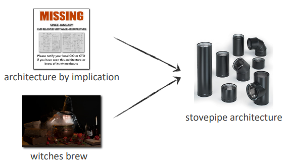

Symptoms and consequences:
- lack of proper abstraction
- lack of an integration solution
- lack of architecture guidance
- architectures that are difficult to change, difficult to maintain, and break every time you change something

# Modern Trade-off Analysis
Use ***qualitative*** analysis to iterate on design, leading to ***quantitative*** analysis.

A business driver will translate to a set of architectural characteristics which lead to an analysis trade-off by an architect:

Example:
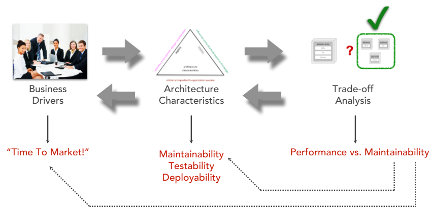

2 useful principles:
| Feature | Goldilock Principle | Good-enough Principle |
|---|---|---|
| Goal | Find the optimal/exact "sweet spot" | Stop at "sufficient" to save time/energy |
| Metaphor | "Just right" | "Done is better than perfect" | 
| Main Use | Balancing variables (e.g., stress, speed) | Decision-making and productivity| 

Architecture styles and their best characteristics:
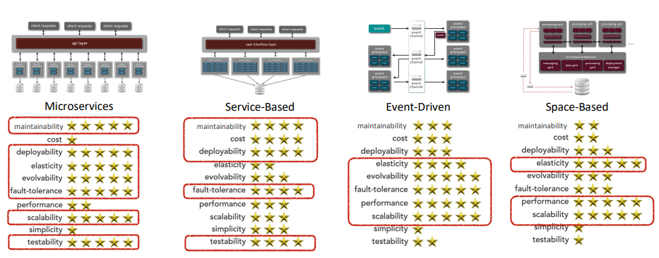

Diagram for trade-off analysis:
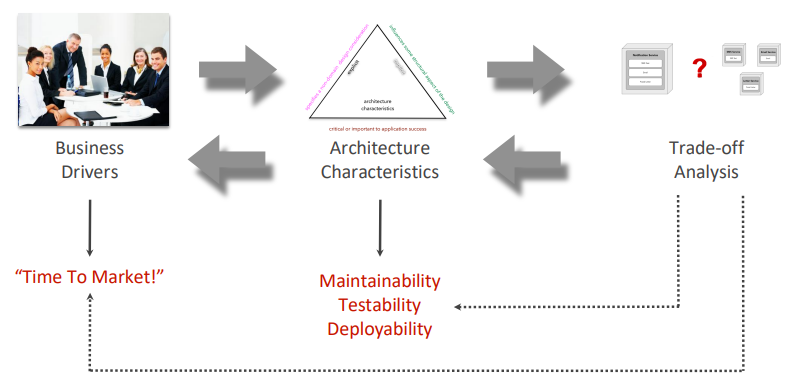

For example, if the desired architecture characteristics are maintainability, testability, and deployability, then the best architecture style for this scenario is microservices, followed by service-based, event-driven, and space-based:
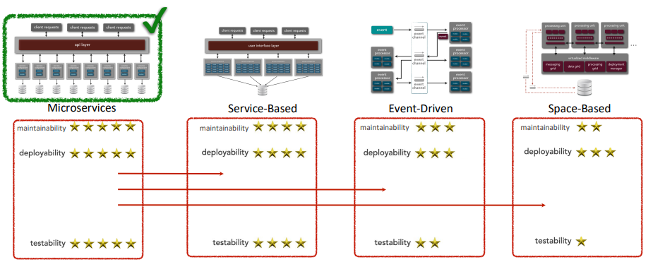

To build your own qualitative analysis:
1. Choose a suitable scale: e.g. 5 stars => 20% per star
2. Choose high value criteria

## Architecture Fitness Function
=> provides an **objective** integrity assessment of some architectural characteristic(s).

---

# Software Architecture Laws
1. Everything is a trade-off. Correlation to this is that the architecture analysis inever done just once.
2. Why is more important than how
3. Most architecture decisions aren't binary but rather exist on a spectrum between extremes

# Source

## Live Events:
- [Software Architecture Patterns and Antipatterns by Neal Ford and Raju Gandhi](https://learning.oreilly.com/live-events/software-architecture-patterns-and-antipatterns/0642572203900/0642572320140/)

## Books:
- [Software Architecture Patterns, Antipatterns, and Pitfalls by Mark Richards, Neal Ford, Raju Gandhi](https://learning.oreilly.com/library/view/software-architecture-patterns/0642572221119/)
- [Software Architecture: The Hard Parts by Mark Richards, Neal Ford, Pramod Sadalage, Zhamak Dehghani]((https://learning.oreilly.com/library/view/software-architecture-the/9781492086888/)

