There are so many different technologies you can use to communicate between microservices. So many that the choices become overwhelming. Should you use a message broker? gRPC? REST over HTTP? The added complexity here is that new communication technologies are being added all the time, making it harder to choose the right way forward.

# Introduction
Definition of Microservices:
> A type of service oriented architecture where the services are independently deployable and boundaries are primarily defined by the business domain.

Keywords from the definition above:
- service-oriented architecture => a set of **collaborating services** which typically run on different computers, with communication between them done via **network-based protocols**.
- independently deployable => the unit of release (architecture quanta) is a single microservice
- business domain => the structure of the business domain guides the structure of the architecture. The business domain defines the boundaries between microservices

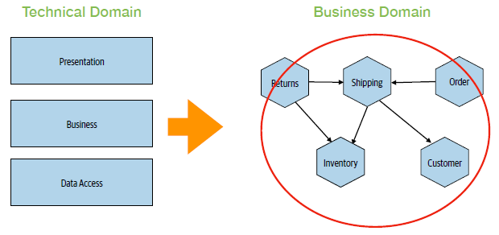

# Distributed Systems
3 Golden Rules of distributed computing:
1. You can't beam information between 2 points instantly
2. Sometimes, you can't reach the point you want to talk to
3. Resource pools are NOT infinite: CPU, network utilisation, memory, disk space

# Communication Styles
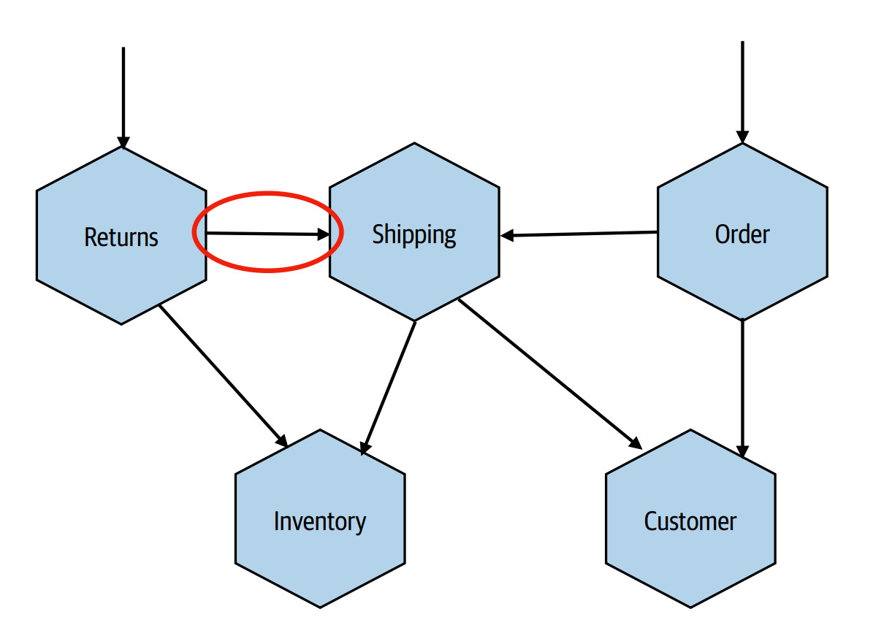

2 main communication styles: 
1. **Request/Response**  
   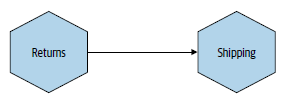
2. **Event-driven**  
   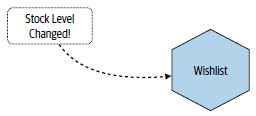

| Request/Response | Event-driven |
|---| ---|
| The consumer is **asking** the microservice for something | The consumer is is **reacting** to an event |
| The intent lives with the requesting microservice | The intent lives with the recipients of the event  |
| GRPC, REST, CORBA, etc | Kafka |
| ✅ Simpler technology   ✅ Familiar flow   ❌ Tighter coupling | ✅ Better in scaling   ✅ Loose coupling   ❌ Complex failure scenarios |

A microservice can expose multiple endpoints with different communication styles. Separation of private and public API endpoints allows for best mix of communication protocols in the system, e.g. REST on public, GRPC & pub/sub on private.
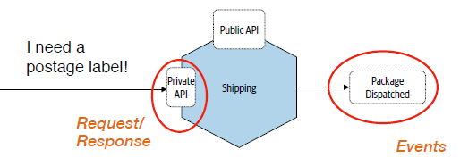

# Defining Boundaries
**Backwards compatibility** is key in having **independent deployability** in microservices. 

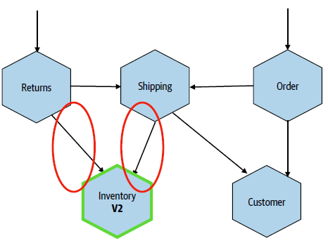

> Anything ***hidden*** can change as needed
> 
> Anything ***exposed*** becomes part of your service interface

## Information Hiding
Information hiding holds an important role to ensure backward compatibility.

> Be **explicit** about what is hidden and what is shared
>
> The **more** you hide: the **easier** it is to maintain ***backward compatibility*** and achieve ***independent deployability***. 

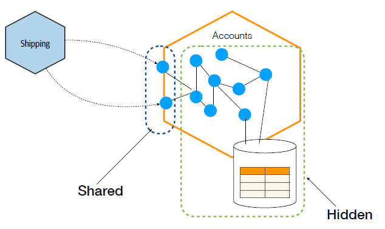

## Consumer-First Mindset
Consumer-first mindset helps us in deciding which information to hide.

This brings us to have an ***outside-in thinking*** rather than inside-out thinking. That is, we treat our microservice endpoints like a User Interface (UI): 
- ***who is going to consume your microservices?***
- ***what are they trying to achieve?***
- ***what SLOs (Service Level Objectives) do your clients need?***
- ***what interface makes their jobs easier?***
- ***what are their requirements in terms of availability and latency?***

> Understand your consumers and what they want, design an endpoint that only exposes what they need. 

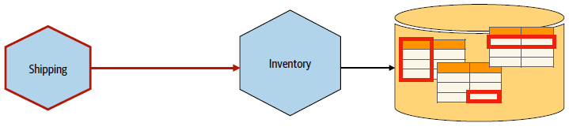

## Schema-First Design (or Contract-First Design)
Schema-first design provides consumers of your microservices with **explicit schemas**. It opens communication with your customers in ***understanding what they need***.

Common use cases:
- GraphQL APIs: Using SDL (Schema Definition Language) to define types.
- REST APIs: Using OpenAPI (Swagger) specifications.
- gRPC APIs: Using Protocol Buffers (.proto files).

# Synchronous vs Asynchronous
Synchrounous vs Asynchronous communication can mean 2 things:
1. Blocking vs non-blocking calls
2. Temporal de-coupling

## Blocking vs Non-blocking Calls
Blocking calls => when the execution of a program needs to wait for the response from a service. Thus, the latency is the total sum of the calls. 

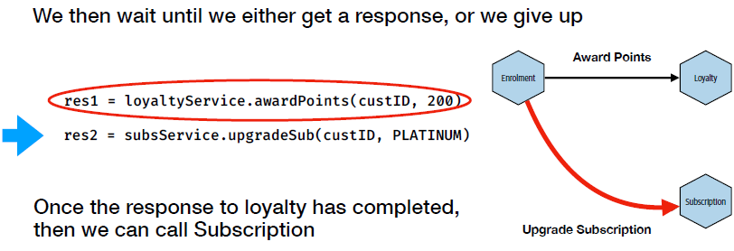

To achieve non-blocking calls, we need to do the calls in **parallel** on separate thread. However, program execution might still need to wait at some point when the response is needed but not yet available. 

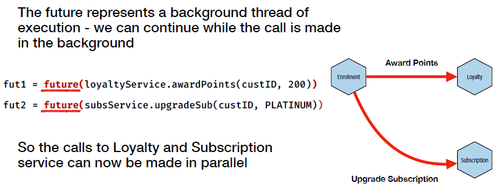

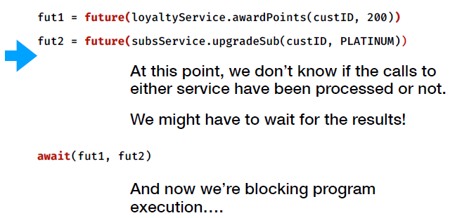

## Temporal Decoupling
Temporal coupling => when *two or more processes* have to be up and available ***at the same time*** for an operation to complete.

To achieve temporal decoupling, we can use intermediaries such as a **broker**.

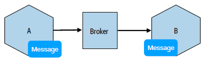

It is arguable that the intermediary-based communication encourages stateless processing as a response can be received by a different instance:
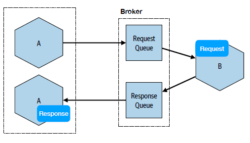

## Summary  

|   Non-blocking Clients   |   Temporal Decoupling   |
|   --------------------   |   -------------------   |
|   Clients don’t block local thread execution whilst waiting for a remote server   |   Remove the need for both client and server to be available at the same time   |

# Sagas
Saga patterns are considered highly suitable for microservices because they solve one of the biggest problems in distributed systems: ***How do you maintain business consistency across multiple independent services without using a giant distributed transaction?***

In a monolith, a single ACID database transaction can coordinate everything.

In microservices, ACID transaction cannot be achieved:
- each service owns its own database
- services are independently deployable
- networks are unreliable
- distributed transactions are expensive and fragile

Also, 2-Phase Commit (2PC) causes problems in microservices architecture:
- Blocking: services hold locks while waiting to commit
- Poor performance: multiple network round trips and synchronous coordination increase latency

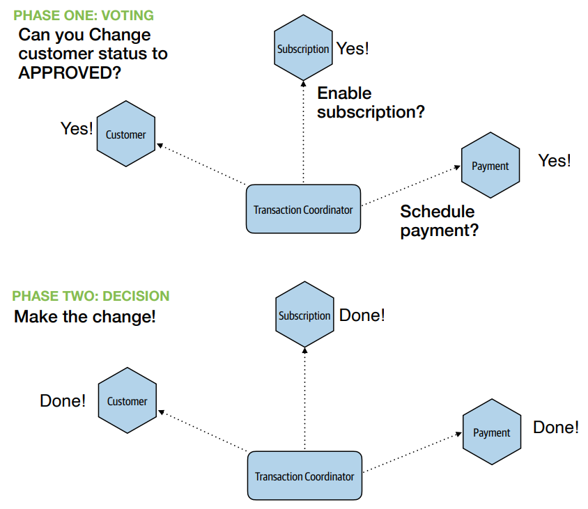

Sagas provide a practical way to coordinate workflows across services while preserving service autonomy:
- **Orchestration** or **Choreographed** coordination
- **Compensating updates** as business-level logic, rather than infrastructure (database) concern, when failure happens

See more information [here](http://www.javarchitect.com/distributed-systems-saga-patterns)

# Key Technologies
## API Gateways
API Gateways act like networking gateway (bridging 2 networks) with additional features around API access.

About API gateways:  

|Good Stuff|Avoid|Notes|
|---|---|---|
|Mapping external calls to internal APIs|Network security for inter-microservice comms|Use a service mesh instead|
|API key management|Protocol rewriting|Do this in the microservice|
|Rate limiting|Call aggregation & filtering|Consider GraphQL or BFF (Backend for Frontend) instead|
|Developer Portals|||

> API Gateways are a vendor product - you don’t want your core system smarts in there
>
> “Keep your endpoints smart, and your pipes dumb”
>
>  Treat API gateways like a dumb pipe!

## Service Meshes
A **service mesh** is an infrastructure layer that manages communication between microservices.  
Instead of implementing networking concerns inside each service, these concerns are delegated to lightweight network proxies (sidecars) managed by the mesh.

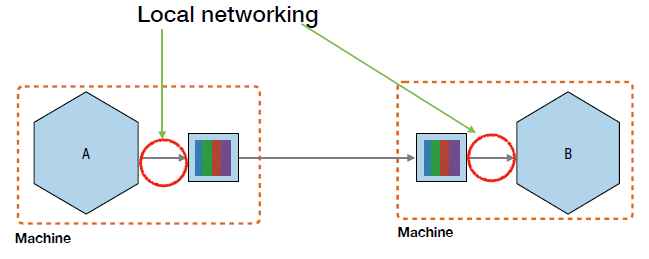

Traditional microservices often duplicate networking logic such as:
- retries
- timeouts
- TLS
- load balancing
- circuit breaking
- metrics
- tracing

A service mesh centralizes these concerns.

Mutual TLS is mostly useful on Kubernetes when using service mesh. A control plane is used to manage sidecars spread around the system, e.g. certificate distribution, etc.

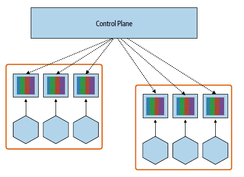

When to use:
- Hugely beneficial for mutual TLS on Kubernetes
- Especially useful for platform teams, and in polyglot environments
- Can be a requirement for other tech (e.g. KNative)

## Message Brokers
In request/response communication, message brokers allows offloading workload with guaranteed delivery:
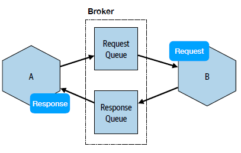

In event-driven communication, message brokers keep tracks of which subscribers have received which events:
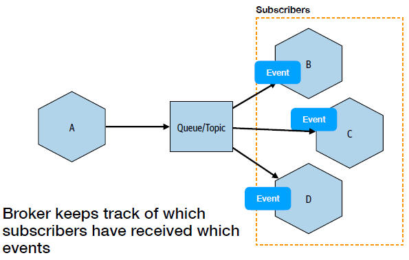

When to use message brokers:
- Reduce/eliminate temporal coupling with your own services
- Offload some of the work for guaranteed delivery
- Especially useful for event-driven interactions

# Retries, Timeouts and Latency
## Timeouts
Timeouts => a threshold after which a request will be terminated if not completed.

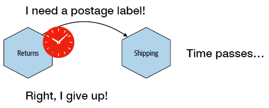

Why timeout:
- resources: the longer you wait, the more resources are used
- recovery: if something is going to fail, you want to fail fast

Timeout management:
1. Understand normal system performance to determine timeout value, e.g. latency distribution chart within your observability tools
2. Error on the side of caution
3. Ensure you can change timeout **independent** of software releases
4. Keep observing!

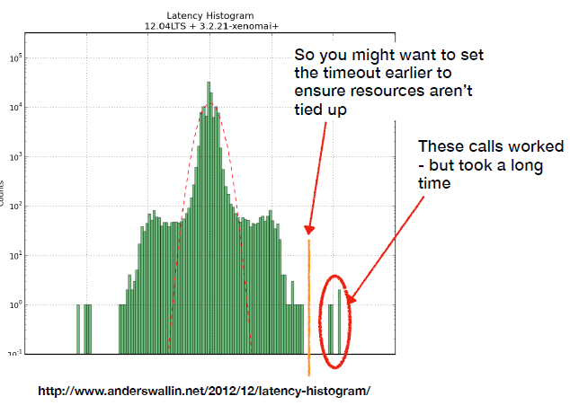

## Retries
#1 in the fallacies of distributed computing is that the network is NOT 100% reliable.

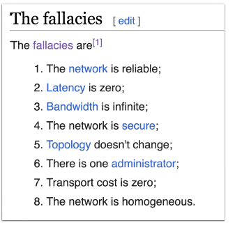

### Idempotency Operations
=> an operation that can be applied *multiple* times **WITHOUT** changing the result. 

Idempotency operations allows multiple retries as a safe mechanism to deal with timeouts or unreliable network.  

For example, this can be achieved by specifying an operation ID in the request.
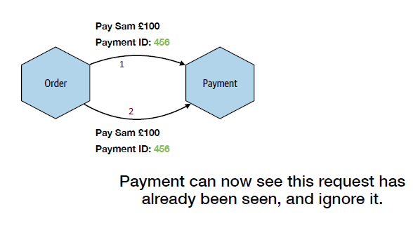

## Latency
Microservices architecture suffers in latency due to lots of network hops. 
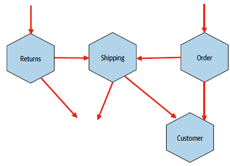

How to improve latency in microservices architecture:
- Be aware of what takes time
- Don’t hide the network (latency) in architecture diagrams
- Run operations in parallel
- Don’t make calls
- Use different technology
- Merge things back together

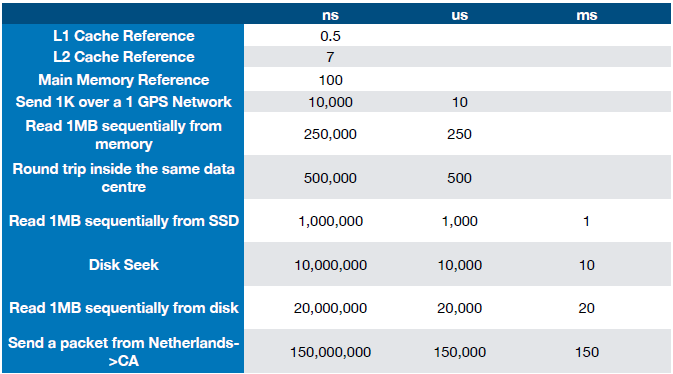

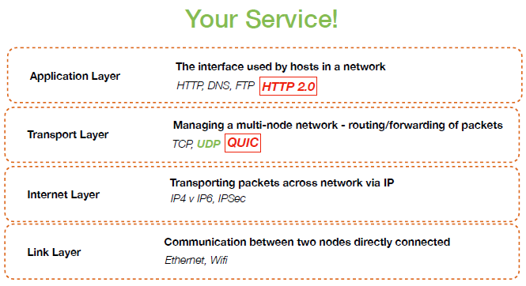

# Technology Links
- [Protobuf is 5-6 times faster than JSON](https://protobuf.dev/)
- [Simple Binary Encoding (SBE) is more efficient than Protobuf](https://github.com/aeron-io/simple-binary-encoding)
- [Linkerd](https://linkerd.io/)
- [Istio](https://istio.io/)
- [Temporal](https://temporal.io/)
- [Specmatic](https://specmatic.io/)
- [Confluent - schema management](https://docs.confluent.io/current/schema-registry/index.html)
- [OpenAPI-diff](https://github.com/OpenAPITools/openapi-dif)
- [HTTP/3 = HTTP/2 over QUIC](https://www.slideshare.net/slideshow/http3-129039527/129039527)
- [QUIC](https://www.google.com/url?sa=t&rct=j&q=&esrc=s&source=web&cd=&cad=rja&uact=8&ved=2ahUKEwiQkrv79riUAxVGQUEAHUOrHGAQwqsBegQIaRAB&url=https%3A%2F%2Fwww.youtube.com%2Fwatch%3Fv%3DsULCOKfc87Y&usg=AOvVaw0-TfGhBKectSmQC2KsJ6DL&opi=89978449)

# Resource
- *Microservices Comms Styles and Patterns: Microservice Collaboration* - Live Event by Sam Newman
- [Building Microservices by Sam Newman](https://www.oreilly.com/library/view/building-microservices-2nd/9781492034018/)

